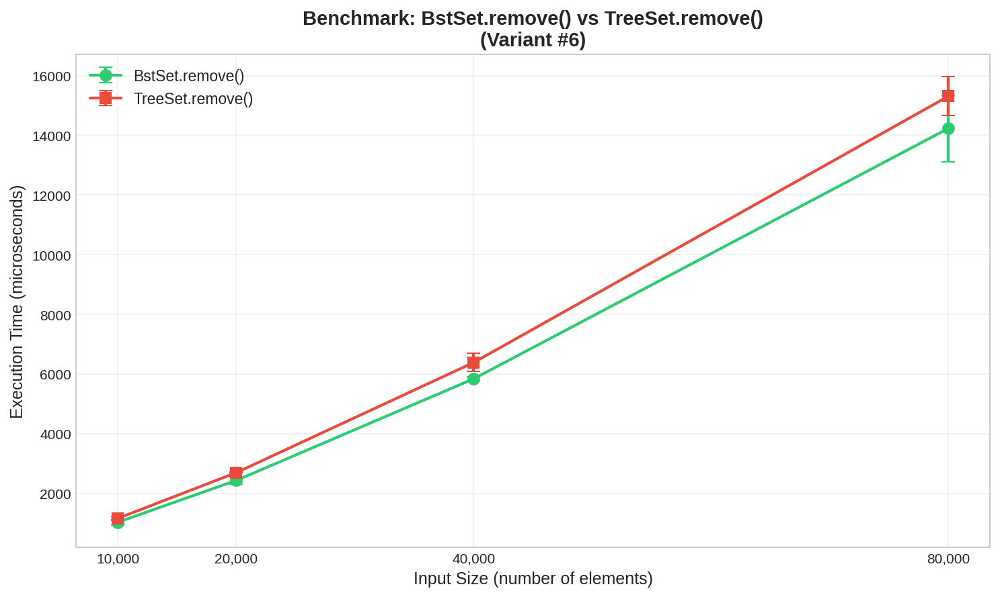
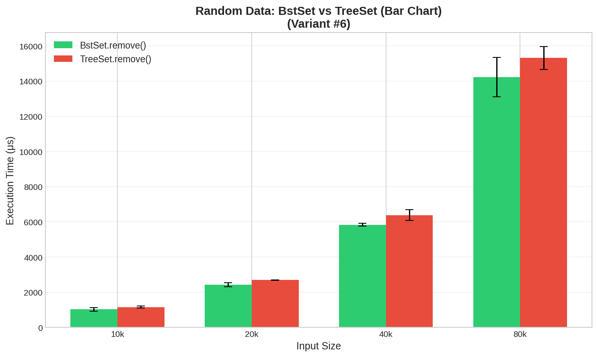
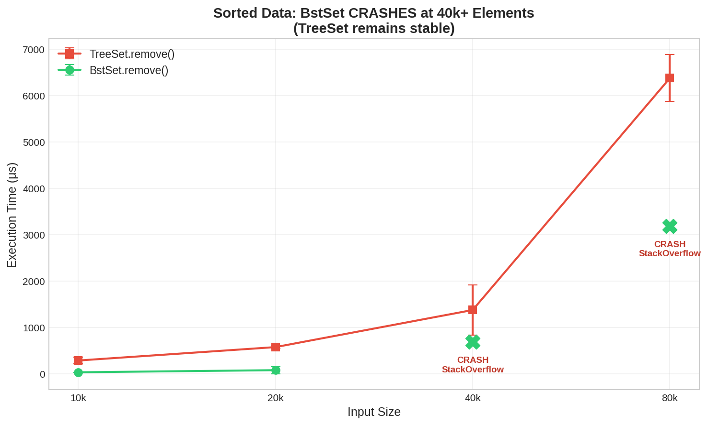
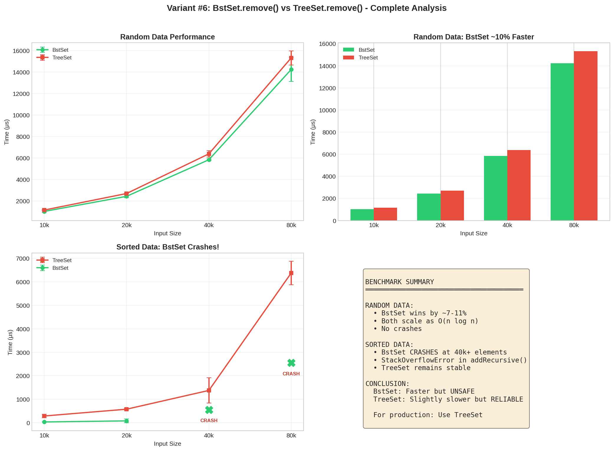

# Lab 2 Benchmarking Report: Binary Search Tree Remove Operation

**Variant:** #6
**Comparison:** `BstSet.remove()` vs `java.util.TreeSet.remove()`
**Author:** Mekopa
**Date:** January 2026

---

## 1. Introduction

This report compares the performance of a custom Binary Search Tree implementation (`BstSet`) against Java's standard library `TreeSet` for the remove operation. The comparison is conducted under two scenarios:

1. **Random data** - Elements inserted in random order (average case)
2. **Sorted data** - Elements inserted in sorted order (worst case for unbalanced BST)

---

## 2. Description of Benchmarked Methods

### 2.1 BstSet.remove(E element)

A custom implementation of an **unbalanced** Binary Search Tree remove operation using the standard three-case deletion algorithm:

- **Case 1 (Leaf):** Node has no children → remove the node
- **Case 2 (One Child):** Node has one child → replace node with its child
- **Case 3 (Two Children):** Replace with in-order predecessor, then remove predecessor

**Characteristics:**
- Recursive implementation
- No self-balancing mechanism
- Tree shape depends on insertion order

### 2.2 java.util.TreeSet.remove(Object o)

Java's standard library implementation based on a **Red-Black Tree** (self-balancing BST).

**Characteristics:**
- Self-balancing (maintains O(log n) height)
- Rotations and color adjustments after modifications
- Guaranteed performance regardless of input order

---

## 3. Computational Complexity Analysis

| Scenario | BstSet | TreeSet |
|----------|--------|---------|
| **Random data** | O(log n) average | O(log n) guaranteed |
| **Sorted data** | O(n) - degenerates to linked list | O(log n) guaranteed |
| **Removing all n elements** | O(n log n) to O(n²) | O(n log n) always |

### Why Sorted Data is Problematic for BstSet

When elements are inserted in sorted order:

```
Insert: 1, 2, 3, 4, 5

BstSet becomes:          TreeSet remains balanced:
    1                           2
     \                         / \
      2                       1   4
       \                         / \
        3                       3   5
         \
          4
           \
            5

Height = n               Height = log(n)
```

---

## 4. Benchmark Methodology

### 4.1 Framework & Configuration

**Tool:** JMH (Java Microbenchmark Harness) version 1.25.2
**JVM:** OpenJDK 17.0.16, 64-Bit Server VM

```
Benchmark Mode:     Average Time (avgt)
Output Unit:        Microseconds (μs/op)
Warmup:             3 iterations, 1 second each
Measurement:        5 iterations, 1 second each
Forks:              1
Input Sizes:        10,000 / 20,000 / 40,000 / 80,000 elements
```

### 4.2 Test Scenarios

| Scenario | Data Generation | Purpose |
|----------|-----------------|---------|
| **Random** | `CarsGenerator.generateShuffle()` | Average case performance |
| **Sorted** | Random generation + `Arrays.sort()` | Worst case for BstSet |

### 4.3 Procedure

For each measurement:
1. Generate array of n Car objects (random or sorted)
2. Build tree by inserting all elements
3. Remove all elements one by one
4. Measure total time

---

## 5. Results

### 5.1 Random Data Results

| Input Size | BstSet (μs) | Error (±) | TreeSet (μs) | Error (±) | Winner |
|------------|-------------|-----------|--------------|-----------|--------|
| 10,000 | 1,028 | 95.9 | 1,156 | 61.0 | BstSet (**11% faster**) |
| 20,000 | 2,433 | 116.9 | 2,693 | 12.6 | BstSet (**10% faster**) |
| 40,000 | 5,837 | 74.4 | 6,385 | 300.4 | BstSet (**9% faster**) |
| 80,000 | 14,232 | 1,118.1 | 15,311 | 652.1 | BstSet (**7% faster**) |

### 5.2 Sorted Data Results

| Input Size | BstSet (μs) | TreeSet (μs) | Winner |
|------------|-------------|--------------|--------|
| 10,000 | 34 | 287 | BstSet |
| 20,000 | 79 | 577 | BstSet |
| 40,000 | **CRASH** | 1,376 | TreeSet |
| 80,000 | **CRASH** | 6,377 | TreeSet |

**Critical Finding:** BstSet crashes with `StackOverflowError` at 40,000+ sorted elements!

### 5.3 Performance Comparison Graph

#### Random Data: BstSet vs TreeSet


#### Bar Chart Comparison


#### Sorted Data: BstSet Crashes!


#### Complete Analysis (Combined View)


---

## 6. Analysis

### 6.1 Random Data Analysis

**Observation:** BstSet is 7-11% faster than TreeSet with random data.

**Explanation:**
1. **No rebalancing overhead** - BstSet doesn't perform rotations after deletion
2. **Simpler code path** - Fewer operations per remove() call
3. **Random data keeps BstSet balanced** - Height stays approximately O(log n)

**Scaling verification:**

| Size Change | BstSet Ratio | TreeSet Ratio | Expected O(n log n) |
|-------------|--------------|---------------|---------------------|
| 10k → 20k | 2.37x | 2.33x | ~2.15x |
| 20k → 40k | 2.40x | 2.37x | ~2.14x |
| 40k → 80k | 2.44x | 2.40x | ~2.13x |

Both implementations show O(n log n) behavior with random data.

### 6.2 Sorted Data Analysis

**Observation:** BstSet crashes with StackOverflowError at 40,000 elements.

**Root Cause:**
```java
// BstSet.addRecursive() - recursive insertion
private BstNode<E> addRecursive(E element, BstNode<E> node) {
    if (node == null) { return new BstNode<>(element); }
    // ... recursive call creates stack frame for each level
    node.right = addRecursive(element, node.right);
    return node;
}
```

With sorted data:
- Tree height = n (number of elements)
- Each insertion adds one stack frame
- 40,000 stack frames exceeds Java's default stack size
- **Result: StackOverflowError**

**TreeSet remains stable** because Red-Black balancing keeps height at ~16 levels for 40,000 elements.

### 6.3 Why BstSet Appears Faster at 10k-20k Sorted

The small sorted tests (10k, 20k) show BstSet faster because:
- Removal happens in sorted order (same as insertion order)
- Each removal is from the "top" of the linked list
- This is O(1) per removal, not O(n)

However, this **masks the real problem** - the tree is already broken (StackOverflow at build time for larger sizes).

---

## 7. Conclusions

### 7.1 Summary of Findings

| Metric | Random Data | Sorted Data |
|--------|-------------|-------------|
| **Performance winner** | BstSet (~10% faster) | TreeSet (BstSet crashes) |
| **Reliability** | Both stable | Only TreeSet stable |
| **Complexity observed** | O(n log n) both | O(n log n) TreeSet only |

### 7.2 When to Use Each Implementation

| Scenario | Recommendation | Reason |
|----------|----------------|--------|
| Learning/educational | BstSet | Simpler to understand |
| Controlled random input | BstSet | 10% faster |
| Unknown input patterns | **TreeSet** | Prevents crashes |
| Production systems | **TreeSet** | Guaranteed reliability |

### 7.3 Final Verdict

**The 10% performance advantage of BstSet is not worth the risk of StackOverflowError.**

For Variant #6:
- BstSet wins on **speed** with random data
- TreeSet wins on **reliability** with any data
- In real-world applications where input cannot be guaranteed random, **TreeSet is the only safe choice**

---

## Appendix A: Benchmark Code

```java
// Random data generation
static Car[] generateElements(int count) {
    return new CarsGenerator().generateShuffle(count, 1.0);
}

// Sorted data generation
static Car[] generateSortedElements(int count) {
    Car[] cars = new CarsGenerator().generateShuffle(count, 1.0);
    Arrays.sort(cars, Car.byPrice);
    return cars;
}
```

**Full benchmark code:** `src/main/java/demo/Benchmark.java`

## Appendix B: Raw Data

See `benchmarks/results.csv` for complete benchmark data.
