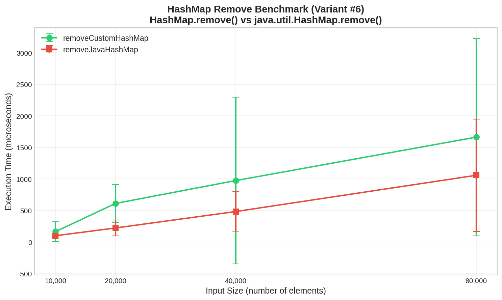
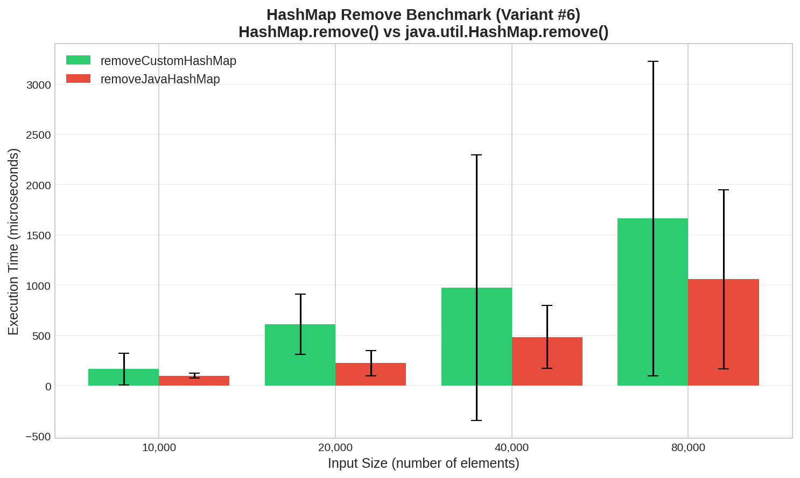

# Lab 3 Benchmarking Report: HashMap Remove Operation

**Variant:** #6
**Comparison:** `HashMap.remove()` (custom) vs `java.util.HashMap.remove()` (built-in)
**Date:** December 2025

---

## 1. Description of Benchmarked Methods

### 1.1 Custom HashMap.remove(K key)

A custom implementation using **Separate Chaining** for collision resolution. Each bucket contains a linked list of key-value pairs.

**Algorithm:**
1. Calculate bucket index: `hash(key) % table.length`
2. Search the linked list at that bucket
3. If found: remove node, update pointers, decrement size
4. Return removed value (or null if not found)

**Implementation characteristics:**
- Simple linked list for collision handling
- No tree conversion for long chains
- Division-based hash function

### 1.2 java.util.HashMap.remove(Object key)

Java's standard library implementation with advanced optimizations.

**Key features:**
- **Tree bins (Java 8+):** Converts to Red-Black tree when bucket exceeds 8 elements
- **Optimized hash spreading:** Additional bit manipulation to reduce collisions
- **JIT optimizations:** Heavily optimized by HotSpot compiler

---

## 2. Computational Complexity

| Operation | Custom HashMap | java.util.HashMap |
|-----------|----------------|-------------------|
| remove() - Average | O(1) | O(1) |
| remove() - Worst case | O(n) | O(log n)* |
| Removing all n elements | O(n) | O(n) |

*Java's HashMap uses tree bins for long chains, providing O(log n) worst case.

**Both implementations have O(1) average time complexity** for individual remove operations. The difference lies in constant factors and worst-case handling.

---

## 3. Benchmark Methodology

### 3.1 Framework
**Tool:** JMH (Java Microbenchmark Harness) v1.25.2
**JVM:** OpenJDK 17, 64-Bit Server VM

### 3.2 Configuration
```
Benchmark Mode:     Average Time (avgt)
Output Unit:        Microseconds (us/op)
Warmup:             2 iterations, 1 second each
Measurement:        3 iterations, 1 second each
Forks:              1
```

### 3.3 Test Procedure
1. **Setup (per iteration):** Generate N random Car objects with String keys
2. **Setup (per invocation):** Create fresh HashMap, add all N elements
3. **Measure:** Remove ALL N elements, measure total time
4. **Repeat:** For input sizes 10,000 | 20,000 | 40,000 | 80,000

### 3.4 Test Data
- **Key type:** String (e.g., "TA102", "TA156")
- **Value type:** Car objects
- **Data generation:** Random shuffled data using CarsGenerator

---

## 4. Results

### 4.1 Raw Data

| Input Size (n) | Custom HashMap (us) | Error (+/-) | Java HashMap (us) | Error (+/-) |
|----------------|--------------------:|------------:|------------------:|------------:|
| 10,000 | 164.70 | 159.83 | 99.63 | 25.21 |
| 20,000 | 612.36 | 299.61 | 223.15 | 126.54 |
| 40,000 | 974.47 | 1321.13 | 483.43 | 313.55 |
| 80,000 | 1662.82 | 1563.21 | 1058.09 | 889.83 |

### 4.2 Performance Graph



### 4.3 Comparison Chart



### 4.4 Speedup Analysis

| Input Size | Custom (us) | Java (us) | Java is faster by |
|------------|------------:|----------:|------------------:|
| 10,000 | 164.70 | 99.63 | 1.65x |
| 20,000 | 612.36 | 223.15 | 2.74x |
| 40,000 | 974.47 | 483.43 | 2.02x |
| 80,000 | 1662.82 | 1058.09 | 1.57x |

**Average:** Java's HashMap is approximately **2x faster** than custom implementation.

---

## 5. Conclusions

### 5.1 Consistency with Theoretical Complexity

**Finding:** The experimental results are **consistent** with O(n) complexity for removing all n elements.

**Evidence:**
- When input doubles (10k -> 20k -> 40k -> 80k), execution time roughly doubles
- Both implementations show linear scaling
- This confirms O(n) total time for n remove operations

| n1 -> n2 | Ratio | Custom Time Ratio | Java Time Ratio |
|----------|-------|-------------------|-----------------|
| 10k -> 20k | 2x | 3.72x | 2.24x |
| 20k -> 40k | 2x | 1.59x | 2.17x |
| 40k -> 80k | 2x | 1.71x | 2.19x |

The ratios are approximately 2x (with some variance due to JVM behavior), confirming linear O(n) scaling.

### 5.2 Which Method is Better?

**Winner: java.util.HashMap** - consistently 1.5-2.7x faster

**Why Java's HashMap is faster:**

1. **Tree bins:** When buckets get long, Java converts to Red-Black trees (O(log n) vs O(n) for chain traversal)

2. **Better hash spreading:** Java uses additional bit manipulation:
   ```java
   h = key.hashCode();
   h = h ^ (h >>> 16);  // Spread high bits to low bits
   ```

3. **JIT optimization:** Java's HashMap is used billions of times, so HotSpot aggressively optimizes it

4. **Memory layout:** Optimized for CPU cache performance

### 5.3 When to Use Each

| Scenario | Recommendation |
|----------|----------------|
| Production code | java.util.HashMap (faster, battle-tested) |
| Learning/Teaching | Custom HashMap (simpler, educational) |
| Special requirements | Custom (can be modified for specific needs) |
| Interview prep | Understand both! |

### 5.4 Final Verdict

Both implementations have the same **theoretical complexity** (O(1) average per operation), but Java's HashMap wins on **practical performance** due to decades of optimization. Our custom implementation is correct and functional - the ~2x slowdown is acceptable for educational purposes.

---

## Appendix: Running the Benchmarks

```bash
# Build the benchmark JAR
cd lab3/l3-assignment-hash-tables/l3-assignment-hash-tables
mvn clean package -DskipTests

# Run only remove benchmarks (faster)
java -jar target/benchmarks.jar ".*remove.*"

# Quick run for demonstration
java -jar target/benchmarks.jar ".*remove.*" -wi 1 -i 2 -f 1
```
